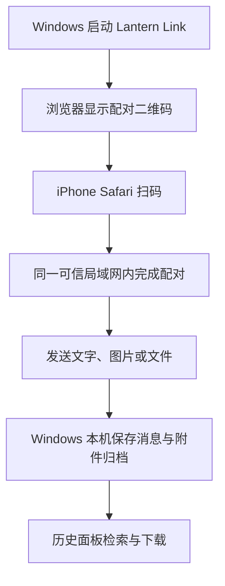

# Lantern Link

> 面向 Windows 与 iPhone 的本机局域网文字、图片和文件传送工具。

[](https://www.python.org/)
[](https://github.com/Rainier-Z/lantern-link)
[](LICENSE)

## 一、项目简介

Lantern Link 是一款本机运行的个人传送工具：Windows 电脑启动服务后，iPhone 使用 Safari 扫描二维码配对，即可在同一可信局域网内传送文字、图片和通用文件。消息、附件元数据和归档都保存在运行程序的 Windows 电脑上，不依赖账号或云端存储。

当前发布为 **1.0 Preview 正式预览版**。它适合个人在可信本地网络中使用；公网中继、跨网络访问和多用户服务不属于这一版本。

## 二、用途

- 在电脑与 iPhone 间快速发送短文字、图片和文件。
- 用手机浏览器扫码连接，无需安装移动端 App。
- 在 Windows 本机保留可检索的消息与附件历史。
- 在同一可信 Wi-Fi 或可信 VPN 下进行临时、私密的设备间传送。

## 三、项目亮点和功能点

### （一）项目亮点

| 项目亮点 | 说明 |
| --- | --- |
| 扫码配对 | 服务启动后生成临时二维码，iPhone 可直接在 Safari 中打开。 |
| 本机优先 | 数据与附件仅落在运行服务的 Windows 电脑，不要求注册账号。 |
| 通用文件 | 一个选择入口同时支持图片与其他常见文件，按内容类型呈现。 |
| 历史可查 | 可按日期、文件类型、格式和文件名查找已传送附件。 |

### （二）核心功能

| 功能 | 说明 |
| --- | --- |
| 文字传送 | 双端发送文字，并在本机持久化保存。 |
| 图片与文件传送 | 支持批量选择、逐项上传、失败单项重试和安全下载。 |
| 本机归档 | 成功附件按日期归档到 Windows 下载目录，并保留历史关联。 |
| 历史面板 | 支持分页加载、筛选与缺失附件提示。 |
| 恢复保护 | 归档与删除使用可恢复状态，启动时会处理可安全清理的过期暂存文件。 |

## 四、工作流程



## 五、入门指南

### （一）前提条件

- Windows 10 或更新版本。
- Python 3.11 或更新版本。
- Windows 电脑与 iPhone 位于同一可信 Wi-Fi 或可信 VPN。
- iPhone 使用 Safari；无需额外安装 App。

### （二）安装

克隆仓库并进入项目目录：

```powershell
git clone https://github.com/Rainier-Z/lantern-link.git
cd lantern-link
```

创建 Python 环境并安装依赖：

```powershell
py -3.11 -m venv .venv
.\.venv\Scripts\python.exe -m pip install -r requirements.txt
```

启动 Lantern Link：

```powershell
.\.venv\Scripts\python.exe -m app.main
```

启动后，在 Windows 浏览器中打开应用页面，使用 iPhone 相机扫描配对二维码并在 Safari 中继续。请保持两台设备在同一可信网络中；访客 Wi-Fi、热点或 VPN 策略可能会阻止设备之间互访。

### （三）验证

安装开发依赖后，可运行完整测试：

```powershell
.\.venv\Scripts\python.exe -m pip install -r requirements-dev.txt
.\.venv\Scripts\python.exe -m pytest -q
```

## 六、预览版范围

本版本已经提供本机持久化、文字传送、图片与通用文件传送、附件历史和本机归档。它不提供公网域名、云端中继、跨网络访问、账号、多用户协作、TLS、原生移动端、断点续传或跨设备同步。

二维码与配对链接只应在可信设备之间使用；请勿将它们分享给他人，也不要将本机服务暴露到互联网或公共 Wi-Fi。

## 七、参与贡献

欢迎提交 Issue 和 Pull Request。提交改动前请运行测试，并在涉及传送流程时说明已验证的设备与网络场景。

## 八、许可证

本项目按 [MIT License](LICENSE) 发布。
